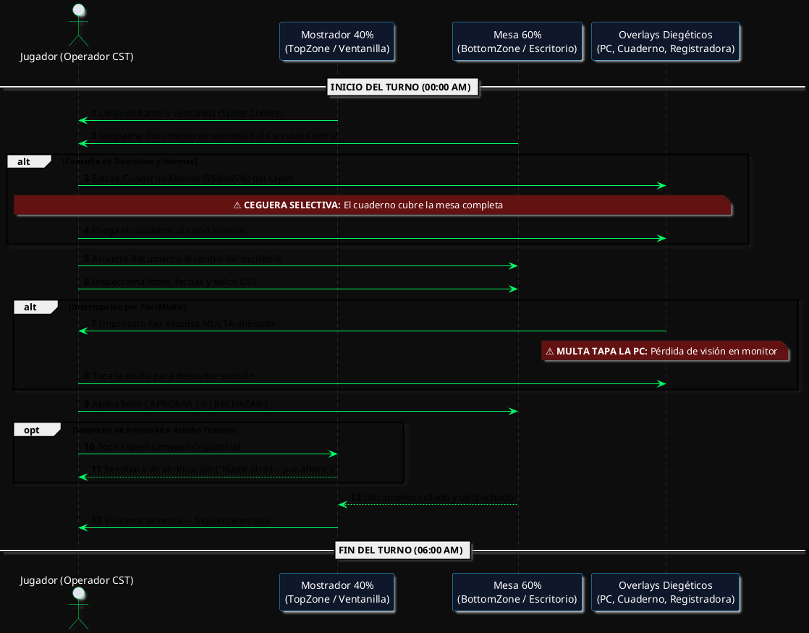
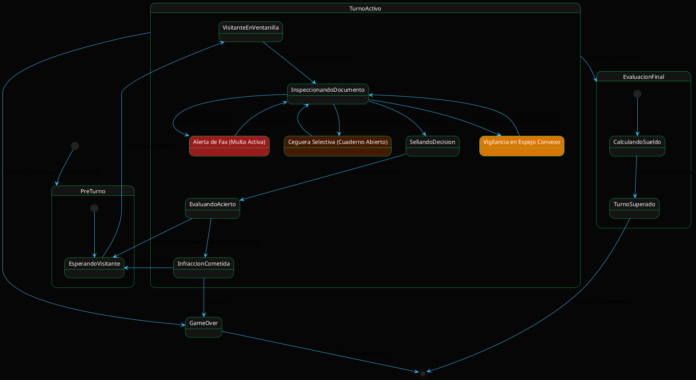
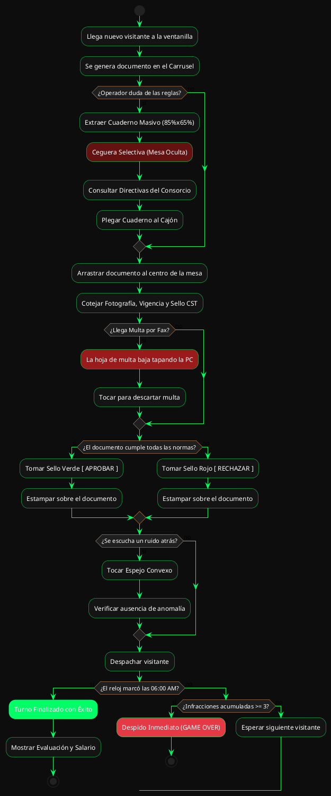

# 🎙️ GUÍA DE REUNIÓN Y DIAGRAMAS DE FLUJO (PRESENTACIÓN AL EQUIPO)
## ISN'T BEHIND — Simulador de Gestión & Thriller Psicológico 2D

**Rol del Expositor:** Director de Arte y QA (Líder de Proyecto)  
**Audiencia:** Dev 1 (Core/Navegación), Dev 2 (Menú/Intros), Dev 3 (Gameplay/Mesa de Trabajo)  
**Objetivo de la Reunión:** Alinear al equipo sobre la visión del juego, explicar la filosofía de "UI Diegética / Ceguera Selectiva", presentar los diagramas de flujo y asignar las ramas de Git sin fricciones.

---

## 1. 🗣️ GUION DEL DISCURSO (QUÉ DECIRLES PASO A PASO)

### Paso 1: Introducción y Estado del Proyecto (El "Pitch")
> *"Hola equipo. Les resumo dónde estamos: La base técnica del proyecto está 100% montada y blindada. Tenemos TypeScript estricto con 0 errores, Modo Inmersivo real en Android (ocultando barras nativas) y un sistema tipográfico de 11 fuentes que ambienta el juego en el contexto corporativo y burocrático de los años 2000."*

### Paso 2: Por qué usamos "Colorboxing" (Cajas de Colores)
> *"Verán que la pantalla de turno no tiene aún los sprites finales, sino cajas de colores contrastantes con textos en español. Esto es una decisión deliberada de ingeniería y arte llamada **Colorboxing**. Nos permite probar el equilibrio de la pantalla, la física táctil y la ergonomía del gameplay antes de integrar las ilustraciones finales sin romper código."*

### Paso 3: El Concepto Clave: "UI Diegética" y "Ceguera Selectiva"
> *"El corazón del terror en este juego no son los sustos fáciles (jumpscares), sino la **tensión por falta de visión (Ceguera Selectiva)**:*
> 1. *Si estás revisando la PC, el Fax te escupe una multa que te tapa el monitor.*
> 2. *Si sacas el Cuaderno de notas para ver las reglas, este es masivo (85% de la pantalla) y te tapa los documentos y al cliente.*
> 3. *Si abres la Caja Registradora para cobrar, bloqueas el escritorio.*
> 4. *Y mientras estás ciego atendiendo papeles... algo puede estar pasando en la ventanilla o detrás de ti en el espejo convexo."*

### Paso 4: Asignación y Reglas de Git
> *"Para no pisarnos código en Git, cada uno tiene asignada una carpeta exclusiva documentada en `/docs/05_sprint1_tasks.md`:*
> - ***Dev 1:** Se enfoca en Core (`src/components/core/`, `AssetProvider` y guards de navegación).*
> - ***Dev 2:** Se enfoca en Menú e Intros (`src/screens/MainMenu*`, `WeeklyIntro*`, `DailyIntro*` y efectos CRT).*
> - ***Dev 3:** Se enfoca en las mecánicas de la mesa (`src/components/shift/`, arrastre de documentos, sellos y el espejo).*
> - *Yo estaré en QA revisando los PRs y asegurando que el arte y la experiencia sean consistentes."*

---

## 2. 📊 DIAGRAMA 1: FLUJO GENERAL DEL JUGADOR (USER FLOW - MERMAID)

```mermaid
flowchart TD
    A["📱 INICIO DE APP<br>(Splash Screen & FontProvider 11 Fuentes)"] --> B["🖥️ MENÚ PRINCIPAL (MainMenuScreen)<br>Split 35/65, Logo Giratorio, Estética CRT"]
    
    B -->|Tocar [ SETTINGS ]| B1["⚙️ Modal de Configuración<br>(Volumen & Hápticos)"]
    B -->|Tocar [ EXIT ]| B2["🚪 Diálogo de Salida (ExitApp)"]
    B -->|Tocar [ STORY ]| C["📻 TRANSMISIÓN RADIAL (WeeklyIntroScreen)<br>Efecto Typewriter, Radio AM, Frecuencia 84.2"]
    
    C -->|Confirmar Recepción| D["📜 ENCABEZADO BUROCRÁTICO (DailyIntroScreen)<br>Sello CST, Número de Día Dinámico"]
    
    D -->|Iniciar Turno| E["🚨 MESA DE CONTROL (ShiftScreen)<br>Layout Split 40/60 & Modo Inmersivo"]
    
    subgraph BUCLE_TURNO [Bucle Nocturno 00:00 - 06:00]
        E --> E1["1. Llega Visitante a la Ventanilla"]
        E1 --> E2["2. Consultar Cuaderno Masivo (85%x65%)"]
        E2 --> E3["3. Arrastrar Documento del Carrusel"]
        E3 --> E4["4. Estampar Sello [APROBAR] o [RECHAZAR]"]
        E4 --> E5["5. Vigilar Espejo Convexo / Retaguardia"]
    end
    
    BUCLE_TURNO -->|Fin de Turno (06:00 AM) / Strikes < 3| F["🏆 EVALUACIÓN DEL DÍA<br>(Aprobados, Errores, Sueldo)"]
    BUCLE_TURNO -->|3 Strikes / Ataque / Cordura 0| G["💀 GAME OVER<br>(Reintentar Día)"]
    
    F -->|Siguiente Día| D
```

---

## 3. 🔄 DIAGRAMAS PLANTUML DEL BUCLE DE JUEGO (SHIFT GAMEPLAY)

A continuación se incluyen los códigos estándar **PlantUML** listos para renderizar en cualquier visor o plugin UML:

### A. Diagrama de Secuencia PlantUML (Bucle Diegético de Turno)



---

### B. Diagrama de Máquina de Estados PlantUML (State Machine del Bucle de Turno)



---

### C. Diagrama de Actividades PlantUML (Flujo de Decisiones del Operador)


