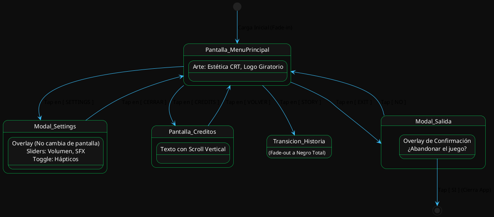
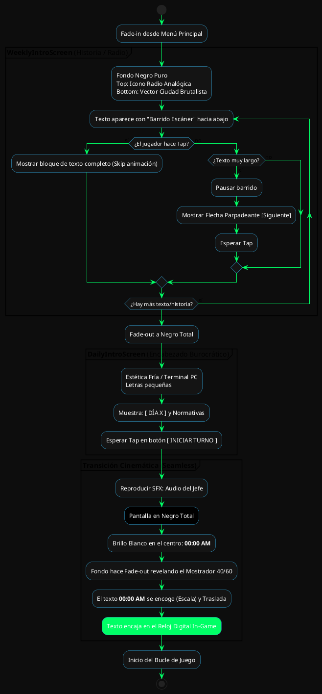
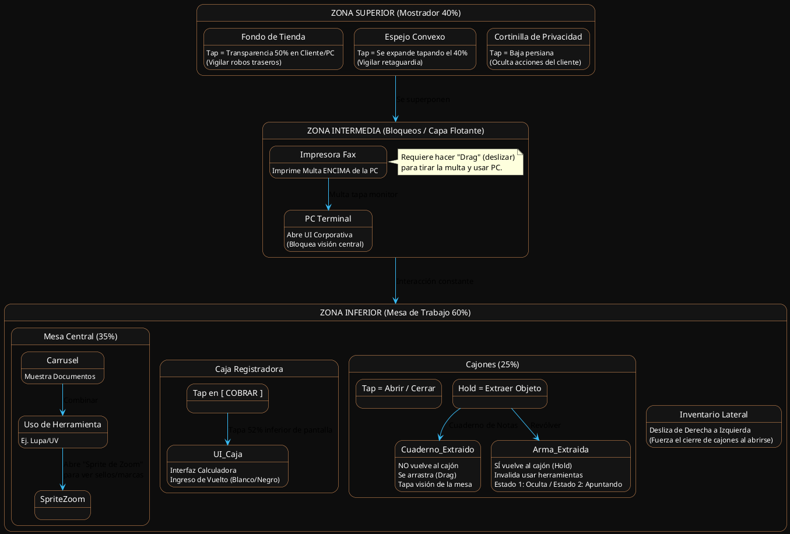
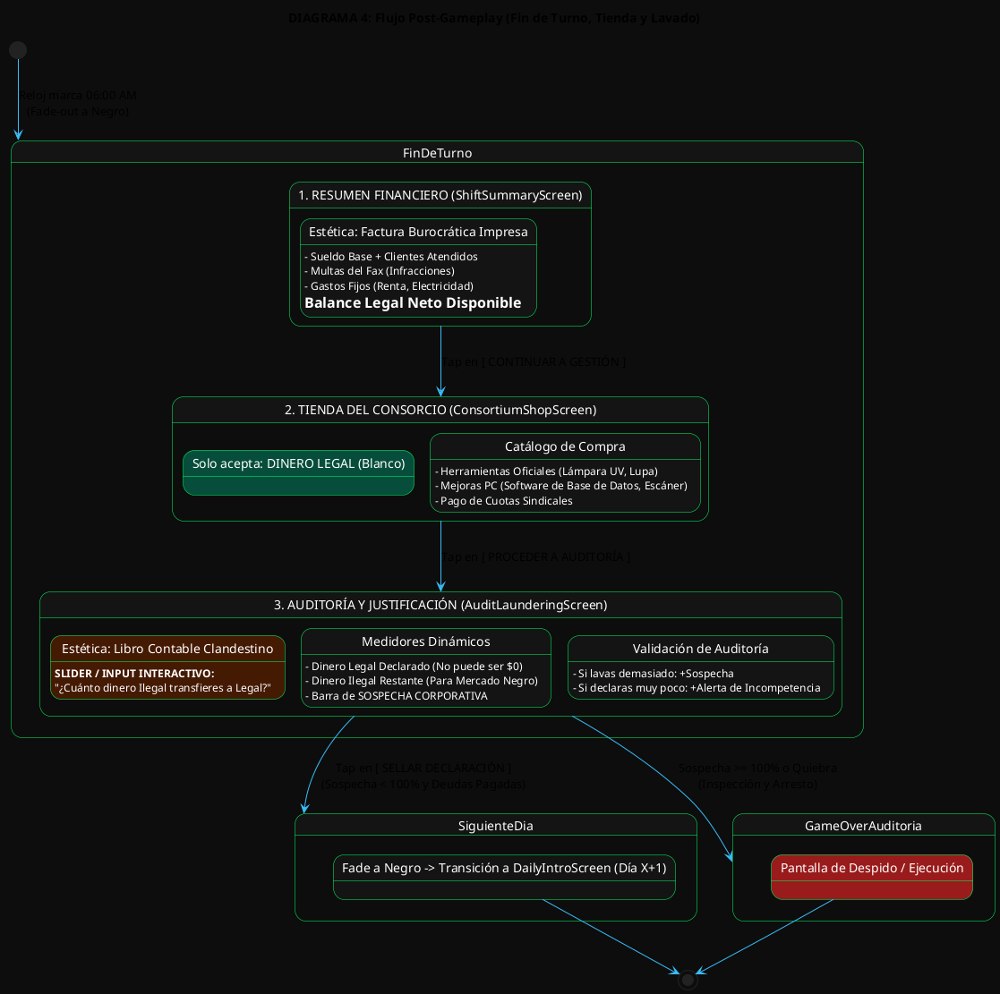

# 🎨 DIAGRAMAS DE INTERFAZ Y FLUJO PARA FIGMA (UI FLOWS)
## ISN'T BEHIND — Guía de Prototipado Visual

**Versión:** 1.1.0  
**Objetivo:** Proveer a los equipos de Arte, UI/UX y Desarrollo una referencia visual, espacial y lógica clara de cómo deben comportarse las pantallas en Figma antes de programar la lógica en React Native.

---

## 1. FLUJO DEL MENÚ PRINCIPAL (`MainMenuScreen`)

Este diagrama establece que todas las opciones del menú principal (excepto `STORY`) operan como modales o overlays sin salir de la vista principal.

---

## 2. TRANSICIONES NARRATIVAS AL BUCLE (`Story -> Shift`)

Mapea la cadencia de la historia de la radio, los "Fade a Negro", y la transición cinemática sin cortes del reloj.

---

## 3. ARQUITECTURA DE INTERFACES DEL TURNO (40/60 & Ceguera Selectiva)

El diagrama más importante para Figma. Dicta qué elementos cubren a otros, y diferencia entre gestos *Tap*, *Hold* y *Drag*.

---

## 4. INTERFACES POST-GAMEPLAY (Resumen, Tienda y Auditoría)

Muestra las 3 pantallas de cierre de turno donde se gestiona la economía legal/ilegal y el minijuego de lavado.

