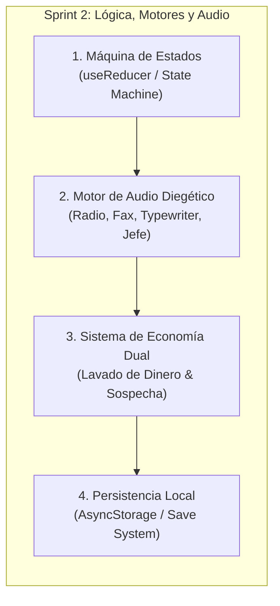

# 📋 PLAN DE SPRINTS Y GOBERNANZA SCRUM
## ISN'T BEHIND — Simulador de Gestión & Thriller Psicológico 2D

**Versión:** 1.0.0 (Alineada al Sílabo Académico & MVP)  
**Scrum Master & Lead:** Rol 1 (Tú)  
**Metodología:** Scrum Ágil / Desarrollo Basado en Tronco con Ramas Temáticas (GitFlow Simplificado)  
**Duración del Sprint 1:** 2 Semanas  
**Duración del Sprint 2:** 2 Semanas (Planificación Futura)  

---

## 👥 1. MATRIZ DE ROLES Y RESPONSABILIDADES

| Rol en el Equipo | Asignación y Especialidad | Entregables Principales en Sprint 1 | Entregables en Sprint 2 (Proyección) |
|---|---|---|---|
| **Rol 1 (Tú)** | **Scrum Master, Lead Artist & Core Dev** | - Gobernanza de `/docs` y revisión de PRs.<br>- Creación y dirección de Sprites principales.<br>- Supervisión de Figma y soporte en `ShiftScreen`. | - Integración del State Machine (`useReducer`).<br>- Sistema de persistencia (Save/Load).<br>- Auditoría general de QA y rendimiento. |
| **Rol 2** | **Asistente de Arte 2D & Prompt Engineer** | - Generación y estandarización de Sprites de Clientes.<br>- Texturas CRT, logos corporativos y vectores de ciudad brutalista.<br>- Catálogo de Prompts y optimización de peso de imágenes. | - Variaciones de sprites para estados de locura/horror.<br>- Sprites de herramientas de mercado negro.<br>- Animaciones frame-by-frame de eventos de hurto. |
| **Rol 3** | **Diseñador Figma & Dev de Gameplay Core** | - Prototipado en Figma de todos los diagramas (`08_figma_ui_diagrams.md`).<br>- Desarrollo en React Native de `ShiftScreen.tsx` y `src/components/shift/*` (Mesa, Carrusel, Espejo, Físicas). | - Mecánicas avanzadas de lupa con zoom dinámico.<br>- Sistema táctil de la lámpara UV.<br>- Pulido de gestos *Hold* y *Drag* en cajones. |
| **Rol 4** | **Desarrollador UI React (Menús y Auxiliares)** | - Desarrollo de `MainMenuScreen` (con modales de Settings/Exit).<br>- `WeeklyIntroScreen` (Efecto escáner de radio) y `DailyIntroScreen`.<br>- Maquetado base de `ShiftSummaryScreen` y `AuditLaunderingScreen`. | - Implementación de sliders interactivos en Lavado de Dinero.<br>- Tienda del Consorcio con filtros de compra.<br>- Pantalla de Créditos con scroll animado. |

---

## 🏃 2. SPRINT 1: PROTOTIPADO FIGMA, SPRITES Y MAQUETADO DE INTERFACES

### 🎯 Objetivo del Sprint 1 (Sprint Goal)
> *"Entregar el prototipo funcional en Figma de todo el juego y las pantallas interactivas en React Native con Colorboxing/Sprites iniciales, navegación inmersiva fluida y cero colisiones de código en Git."*

---

### 📦 Historias de Usuario (Product Backlog Items - Sprint 1)

#### 🎨 ÉPICA A: DISEÑO Y ASSETS (Rol 1, Rol 2, Rol 3)
*   **US-01 [Figma]: Prototipado Completo de Pantallas y Overlays (Rol 3)**
    *   *Descripción:* Diseñar en Figma las 4 macro-vistas: Menú Principal (con modales), Intros (Radio y Burocracia), Mesa de Control 40/60 con capas flotantes y Pantallas de Fin de Turno.
    *   *DoD:* Archivo de Figma compartido, con componentes autolayout y prototipado interactivo de navegación basado en [`08_figma_ui_diagrams.md`](file:///docs/08_figma_ui_diagrams.md).
*   **US-02 [Arte 2D]: Sprites Base y Banco de Prompts (Rol 1 y Rol 2)**
    *   *Descripción:* Producir la primera tanda de assets visuales: 5 sprites de clientes en ventanilla, iconos de herramientas (Lupa, UV, Sellos), texturas de pasaportes y vector de radio analógica.
    *   *DoD:* Carpeta `assets/sprites/` estructurada con archivos PNG optimizados (máx. 250KB c/u) y documento `docs/prompts_catalog.md` con los prompts reproducibles.

---

#### 💻 ÉPICA B: DESARROLLO DE INTERFAZ Y CORE GAMEPLAY (Rol 3, Rol 4, Rol 1)
*   **US-03 [React]: Bucle de Juego y Mesa Interactiva (Rol 3 & Rol 1)**
    *   *Descripción:* Refactorizar `ShiftScreen.tsx` e implementar los componentes en `src/components/shift/`:
        - `ConvexMirror.tsx` (Tap para expandir).
        - `StoreBackground.tsx` (Tap para 50% transparencia en cliente/PC).
        - `DocumentCarousel.tsx` (Carrusel con documentos inspeccionables).
        - `DeskDrawers.tsx` (Cajones con detección de *Tap* para abrir y *Hold* para extraer cuaderno/arma).
    *   *DoD:* Componentes integrados en `ShiftScreen`, sin desbordamientos de pantalla en Android, compilación en 0 errores TS.
*   **US-04 [React]: Menú Principal, Modales y Flujo Narrativo (Rol 4)**
    *   *Descripción:* Programar en React Native:
        - `MainMenuScreen.tsx` con modales flotantes de `SettingsModal` (Sliders de volumen y toggle háptico) y `ExitModal`.
        - `WeeklyIntroScreen.tsx` con efecto de barrido/escáner de texto, botón saltar y soporte de tap continuo.
        - `DailyIntroScreen.tsx` estilo terminal burocrática con botón `[ INICIAR TURNO ]`.
    *   *DoD:* Navegación fluida entre Menú ➔ Radio ➔ Día ➔ ShiftScreen con transiciones en Fade a Negro.
*   **US-05 [React]: Maquetado de Fin de Turno (Rol 4)**
    *   *Descripción:* Maquetar los contenedores y tipografías para `ShiftSummaryScreen` (Factura de sueldo), `ConsortiumShopScreen` (Tienda de herramientas) y `AuditLaunderingScreen` (Libro de lavado).
    *   *DoD:* Pantallas navegables con datos simulados (mock data) respetando el sistema `TYPOGRAPHY` de los años 2000.

---

## 🚀 3. SPRINT 2: SISTEMAS DE JUEGO, LÓGICA DE ESTADO Y AUDIO (PROYECCIÓN)

### 🎯 Objetivo del Sprint 2 (Sprint Goal)
> *"Conectar la lógica de negocio real: máquina de estados finitos del turno, validación de documentos con sellos, sistema de economía dual (Legal/Ilegal), audio diegético inmersivo y guardado de partida."*

---

### 📦 Backlog Proyectado (Sprint 2)



1.  **Módulo de Lógica de Documentos & Sellos:**
    *   Algoritmo determinista para generar incongruencias (fechas expiradas, fotos alteradas, sellos falsos).
    *   Cálculo de aciertos y penalizaciones en tiempo real (+1 Strike por error).
2.  **Módulo de Audio Diegético (Expo Audio):**
    *   Reproducción de estática de radio en `WeeklyIntroScreen`.
    *   Sonido de tipeo matricial al aparecer textos.
    *   SFX de impresión mecánica para el Fax de multas y timbre de la Caja Registradora.
3.  **Lógica del Minijuego de Lavado de Dinero:**
    *   Formulación matemática de la **Sospecha Corporativa**:
        $$\text{Sospecha} = f(\text{Dinero Ilegal Lavado}, \text{Clientes Procesados}, \text{Día Actual})$$
    *   Consecuencias de auditoría (Despido / Intervención armada).
4.  **Persistencia y Progresión:**
    *   Guardado automático al finalizar el día: Dinero legal, dinero negro, herramientas desbloqueadas y día actual.

---

## 🛠️ 4. CEREMONIAS Y CONTROL DE CALIDAD SCRUM

### ⏰ Cadencia de Ceremonias
*   **Daily Standup (Asíncrono / 10 min):**
    1. *¿Qué completé ayer?*
    2. *¿En qué trabajaré hoy?*
    3. *¿Tengo algún bloqueo técnico o de assets?*
*   **Sprint Review & Demo (Fin de Sprint):**
    - Demostración del prototipo en Figma y ejecución en emulador Android de las pantallas desarrolladas.
*   **Sprint Retrospective:**
    - Ajuste de estimaciones y resolución de cuellos de botella entre arte y código.

---

## 🌿 5. ESTRATEGIA DE RAMAS EN GIT (GITFLOW AISLADO)

Para garantizar **cero conflictos** de fusión:

```text
main (Producción / SSoT)
 └── develop (Integración de Sprint)
      ├── feature/rol2-sprites-assets
      ├── feature/rol3-figma-and-shift-core
      └── feature/rol4-menu-intros-summary
```

### Reglas de Aprobación de Pull Request (DoD):
1. Cero errores de TypeScript (`npx tsc --noEmit`).
2. No mezclar archivos asignados a otro compañero.
3. Revisión y aprobación del Scrum Master (Rol 1).
