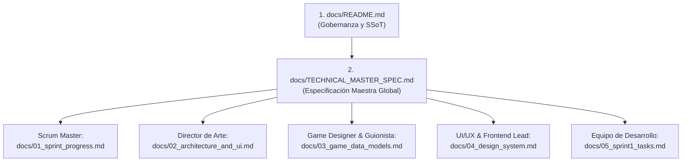

# 📜 ISN'T BEHIND — Guía de Gobernanza y Documentación Técnica (SSoT)

Bienvenido al repositorio central de documentación de **ISN'T BEHIND** (Simulador de gestión y thriller psicológico 2D en React Native / Expo v56+).

Este directorio (`docs/`) es la **Única Fuente de Verdad (*Single Source of Truth - SSoT*)** arquitectónica, técnica, de arte y de diseño del proyecto. Cualquier desarrollador (humano o agente de IA) **DEBE** leer y respetar estas directrices antes de escribir, refactorizar o evaluar una sola línea de código.

---

## 🛑 REGLA INQUEBRANTABLE DE ESPECIFICACIÓN PREVIA (Zero-Spec Prohibited)

> **PROHIBIDO ESCRIBIR CÓDIGO SIN ESPECIFICACIÓN:**  
> Ningún componente, hook, servicio, máquina de estados o pantalla puede ser implementado si no cuenta con su respectivo documento de especificación formal en `docs/` aprobado con los 6 bloques mandatorios:
> 1. **Reglas de Negocio:** Lógica, invariantes y condiciones de victoria/derrota/fallo.
> 2. **Permisos y Seguridad:** Acceso a hardware, almacenamiento y aislamiento de estado.
> 3. **Auditoría y Telemetría:** Eventos registrables, métricas invisibles y logs de sesión.
> 4. **Validaciones:** Contratos de entrada/salida y manejo de estados degradados.
> 5. **Criterios de Aceptación (Gherkin/DoD):** Escenarios mínimos comprobables.
> 6. **APIs y Contratos TypeScript:** Interfaces tipadas estrictas sin `any`.

---

## 🗺️ Mapa y Orden de Lectura por Rol

### Documentos Clave del Repositorio:
1. **[`docs/README.md`](file:///docs/README.md) (Este archivo):** Manifiesto de calidad, principios Clean Architecture y SSoT.
2. **[`docs/01_sprint_progress.md`](file:///docs/01_sprint_progress.md) (Para el Scrum Master):** Estado actual del MVP, componentes existentes y backlog pendiente.
3. **[`docs/02_architecture_and_ui.md`](file:///docs/02_architecture_and_ui.md) (Para el Director de Arte):** Estructura Flexbox (Split 40/60), rutas de SVGs/sprites, paleta hexadecimal y fuentes.
4. **[`docs/03_game_data_models.md`](file:///docs/03_game_data_models.md) (Para el Game Designer y Guionista):** Interfaces TypeScript del juego y esquemas JSON de días, visitantes y diálogos.
5. **[`docs/04_design_system.md`](file:///docs/04_design_system.md) (Para el UI/UX Lead):** Wireframe matemático de `ShiftScreen`, capas absolutas, Z-Indexes, drag bounds, Colorboxing y mapa tipográfico Y2K.
6. **[`docs/05_sprint1_tasks.md`](file:///docs/05_sprint1_tasks.md) (Para el Equipo de Desarrollo):** Asignación modular de tareas del Sprint 1, aislamiento de archivos en Git y criterios de aceptación (DoD).
7. **[`docs/TECHNICAL_MASTER_SPEC.md`](file:///docs/TECHNICAL_MASTER_SPEC.md):** Documento técnico exhaustivo con los 10 módulos del sistema.

---

## 🏛️ Estándares Enterprise y Calidad de Código

### 1. Principios Arquitectónicos
- **Clean Architecture & DDD (Domain-Driven Design):** Separación tajante entre *Dominio* (reglas del juego agnósticas de React), *Aplicación* (casos de uso, servicios, state reducers) e *Infraestructura / UI* (React Native, Expo, AsyncStorage, Sensores).
- **SOLID & SRP Estricto:** Prohibidos componentes oráculo o "God Classes". Cada archivo debe realizar una sola labor.
- **DRY & KISS & YAGNI:** Sin sobre-ingeniería especulativa, pero con desacoplamiento suficiente para soportar escalabilidad extrema.
- **Prohibición de Atajos ("No Quick-and-Dirty Code"):** No se acepta código temporal no tipado ni trucos frágiles de maquetado.

### 2. Estándar de Límites de Archivo y Complejidad
- **Archivos compactos:** Ningún archivo de componente o hook debe exceder las **200 líneas**.
- **Funciones puras y Hooks atómicos:** Las funciones de lógica de negocio deben ser deterministas y testeables unitariamente.
- **Cero `any`:** TypeScript en modo `strict: true`. Todos los payloads de eventos, estados y props deben estar fuertemente tipados.
