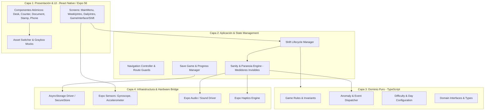
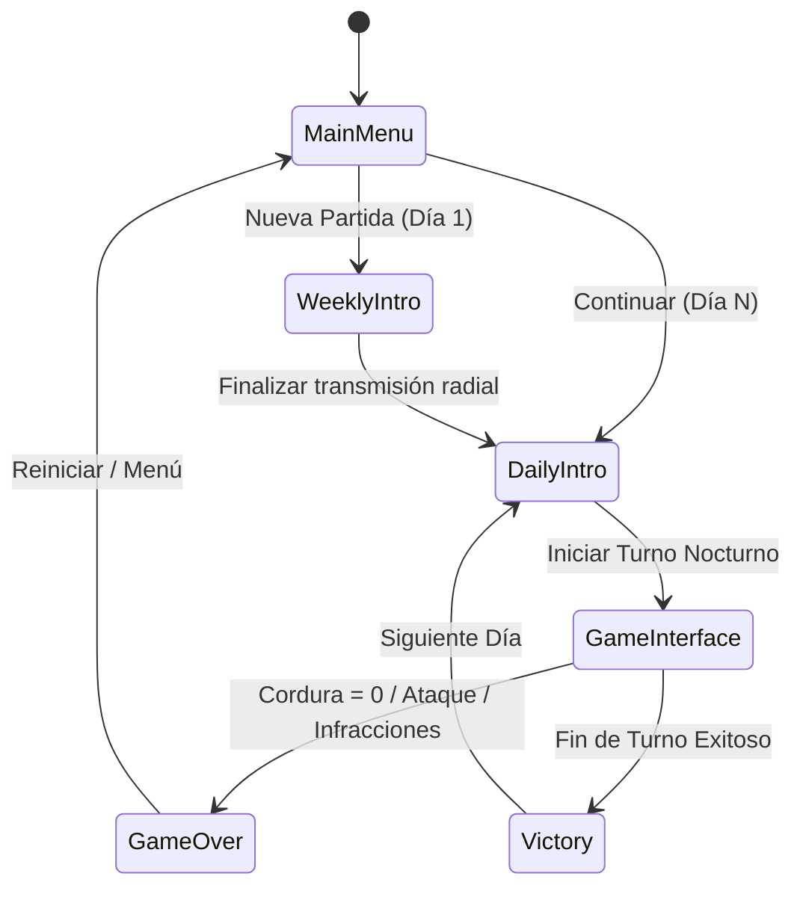
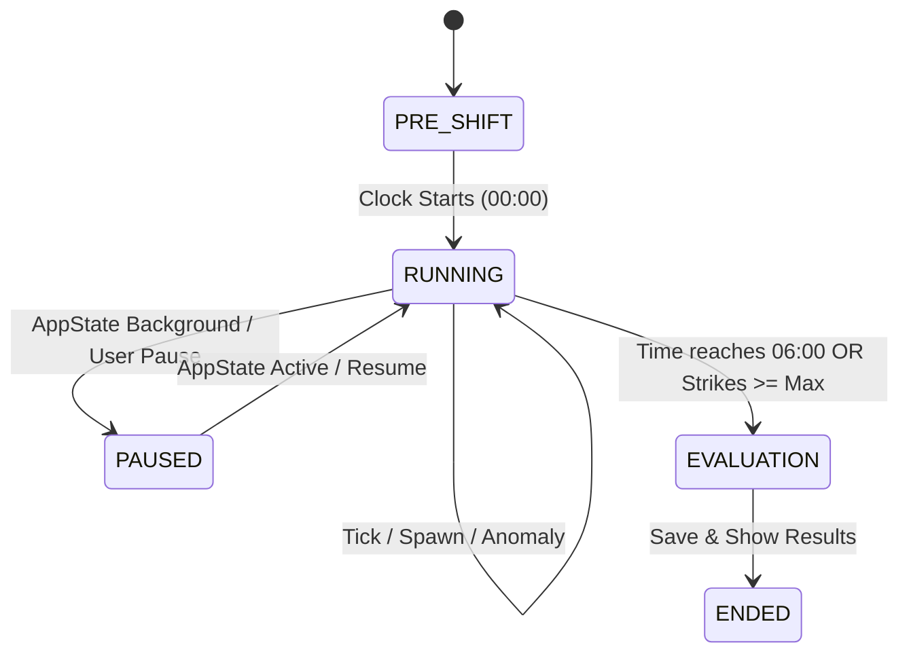
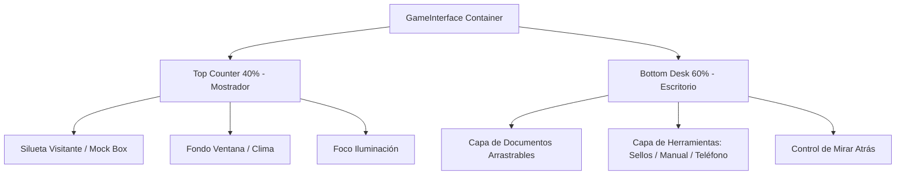
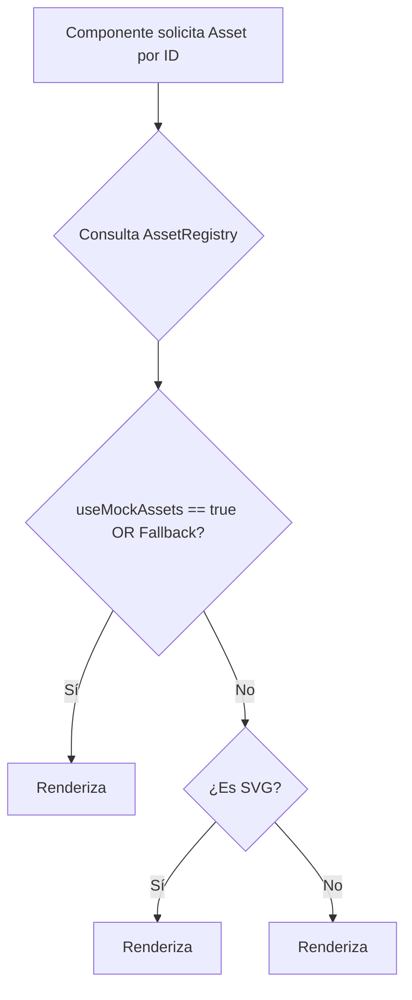
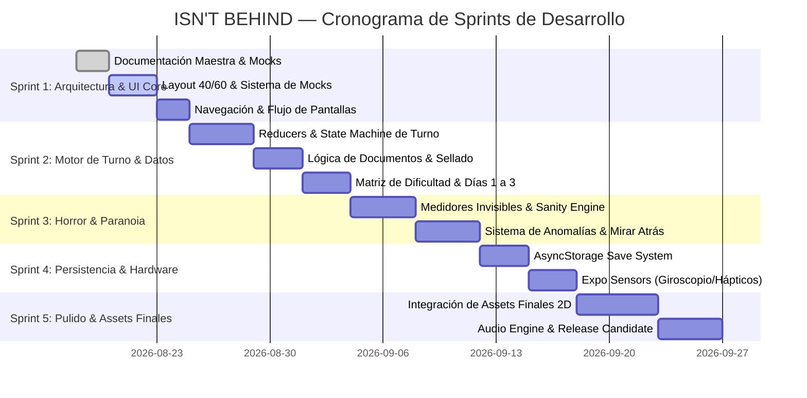

# 📐 ESPECIFICACIÓN TÉCNICA MAESTRA: "ISN'T BEHIND"
## Simulador de Gestión y Thriller Psicológico 2D para Móviles

---

**Versión del Documento:** 1.0.0  
**Fecha de Aprobación:** 2026-08-18  
**Estado:** VIGENTE / BASE INAMOVIBLE  
**Target Runtime:** React Native `0.85.x` / Expo SDK `56.0.x` / React `19.x` / TypeScript `5.x+` (Strict)  
**Arquitectura:** Clean Architecture + Domain-Driven Design (DDD) + Data-Driven State Machine

---

## 1. VISIÓN GENERAL Y PILARES DE DISEÑO

### 1.1 Premisa del Videojuego
**"ISN'T BEHIND"** es un simulador de gestión en 2D combinado con horror psicológico y tensión ambiental. El jugador asume el rol de un recepcionista / operador nocturno en un puesto de control aislado. Durante su turno (de duración y reglas dinámicas según el día), debe procesar visitantes, revisar documentación, sellar autorizaciones y mantener la operativa del puesto mientras lidia con anomalías, llamadas crípticas y la sensación constante de que una presencia acecha a sus espaldas.

### 1.2 Pilares Técnicos Fundamentales
1. **Clean Architecture y Aislamiento de Dominio:** Las reglas de juego, generadores de anomalías y cálculos de paranoia residen en TypeScript puro sin acoplamiento a React ni React Native.
2. **Determinismo Data-Driven:** Todo el estado del turno se representa mediante estructuras serializables (`GameState`, `ShiftState`, `VisitorQueue`, `AnomalyEvent`) para facilitar la migración futura a autómatas finitos (FSM / XState) y testing automatizado.
3. **Desacoplamiento Visual Total (Graybox Mocks vs Real Assets):** La interfaz se construye inicialmente con contenedores `<View>` nativos con fondos planos y textos descriptivos, gobernados por un catálogo centralizado que permite intercambiar en caliente mocks por assets definitivos (`<Image>`, `<Svg>`, animaciones Lottie/Skia) mediante Feature Flags.
4. **Responsividad Matemática Estricta:** Layout estructurado rígidamente en proporción **40% Superior (Mostrador)** y **60% Inferior (Escritorio/Mesa de Trabajo Interactiva)** con cálculo dinámico de escala por dimensiones de pantalla.

---

## 2. ARQUITECTURA GLOBAL DEL SISTEMA



---

## 3. LAYOUT RESPONSIVO Y ESTRATEGIA DE UI (SPLIT 40 / 60)

### 3.1 Anatomía del Viewport
La pantalla de turno (`GameInterface` / `ShiftScreen`) divide la ventana activa de visualización verticalmente en dos zonas maestras:

1. **Zona Mostrador (Superior - 40% del alto total):**
   - Muestra la ventanilla/mostrador, la iluminación exterior, la cola de visitantes, los efectos climáticos y las apariciones visuales.
   - Es una zona predominantemente observacional y de interacción pasiva (tocar para hablar, encender foco de mostrador).
2. **Zona Escritorio / Mesa Interactiva (Inferior - 60% del alto total):**
   - Contenedor con `position: 'relative'` y elementos con capas `position: 'absolute'` (documentos movibles, sello de aprobación/rechazo, libro de reglas, teléfono, cajón).
   - Zona de alta interacción física y manipulación directa.

```text
+-------------------------------------------------------------+
|                     BARRA DE ESTADO / TIEMPO                |
|                                                             |
|                   ZONA 1: MOSTRADOR (40%)                   |
|  - Visitante / Entidad en ventanilla                        |
|  - Ventana / Exterior con niebla o lluvia                   |
|  - Lámpara de mostrador / Micrófono intercooler             |
+-------------------------------------------------------------+
|                                                             |
|                   ZONA 2: ESCRITORIO (60%)                  |
|  - [Documento de Identidad / Formulario]                   |
|  - [Sello Aprobado / Rechazado]                             |
|  - [Teléfono / Intercomunicador]                            |
|  - [Manual de Directivas del Día]                           |
|  - [Controles de Luz / Mirilla Trasera]                     |
|                                                             |
+-------------------------------------------------------------+
```

### 3.2 Fórmulas de Escalado y Normalización
Para garantizar consistencia en pantallas desde 4.7" hasta 7.0" (y tablets):
- **Base Guideline:** Ancho de referencia $W_{base} = 390\text{px}$, Alto de referencia $H_{base} = 844\text{px}$.
- **Factor de Escala:** $S = \min\left(\frac{W_{actual}}{W_{base}}, \frac{H_{actual}}{H_{base}}\right)$.
- **Tipografía Escalada:** $\text{fontSize} = \text{round}(\text{baseSize} \times S)$.
- **Mostrador:** $\text{height}_{counter} = H_{actual} \times 0.40$.
- **Escritorio:** $\text{height}_{desk} = H_{actual} \times 0.60$.

---

## 4. ESPECIFICACIÓN DETALLADA POR MÓDULOS

---

### MÓDULO 01: NAVEGACIÓN Y FLUJO DE PANTALLAS (Navigation Core)

#### 1. Visión y Objetivo
Gestionar de manera robusta y desacoplada la pila de pantallas, transiciones cinematográficas con fundido a negro (`fade`), salvaguarda de rutas activas (`Navigation Guards`) y paso inmutable de parámetros de inicio de día.

#### 2. Reglas de Negocio
- **RN-NAV-01:** La aplicación siempre inicia en `MainMenu` tras la inicialización del `FontProvider` y `SplashScreen`.
- **RN-NAV-02:** Al pulsar "Nueva Partida" o "Continuar", si el día es inicio de semana (Día 1, 8, etc.), debe navegar obligatoriamente por `WeeklyIntro` antes de `DailyIntro`.
- **RN-NAV-03:** Antes de entrar al turno (`GameInterface`), el usuario debe transitar por `DailyIntro` recibiendo `{ dayNumber: number }`.
- **RN-NAV-04:** Durante el turno activo, el botón de retroceso nativo de Android debe estar bloqueado o pedir confirmación para evitar pérdida involuntaria de progreso ("Abandonar turno cuenta como abandono de puesto").

#### 3. Modelo de Datos (TypeScript)
```typescript
export type RootStackParamList = {
  MainMenu: undefined;
  WeeklyIntro: { weekNumber: number };
  DailyIntro: { dayNumber: number };
  GameInterface: { dayNumber: number; shiftConfigId: string };
  GameOver: { reason: GameOverReason; dayNumber: number; score: number };
  Victory: { dayNumber: number; finalEvaluation: ShiftEvaluation };
};

export type GameOverReason = 
  | 'SANITY_DEPLETED' 
  | 'ENTITY_ATTACK' 
  | 'STRIKE_LIMIT_REACHED' 
  | 'TIME_EXPIRED';

export interface ShiftEvaluation {
  processedVisitors: number;
  correctDecisions: number;
  mistakes: number;
  paranoiaPeak: number;
  salaryEarned: number;
}
```

#### 4. APIs y Dependencias
- `@react-navigation/native` (`^7.x`)
- `@react-navigation/native-stack` (`^7.x`)
- `react-native-screens` (`4.x`)
- `react-native-safe-area-context` (`~5.x`)

#### 5. Permisos Requeridos
- Ninguno a nivel de sistema operativo.

#### 6. Auditoría y Telemetría
- Evento `NAV_SCREEN_ENTER`: Registra `screenName`, `timestamp`, `params`.
- Evento `NAV_BACK_BLOCKED`: Registra intentos de salida durante el turno activo.

#### 7. Validaciones
- Validar que `dayNumber >= 1` al entrar a `DailyIntro` y `GameInterface`.
- Si `dayNumber` no existe en la matriz de configuración, redirigir a `MainMenu` con error controlado.

#### 8. Diagrama de Flujo


#### 9. Criterios de Aceptación
- [ ] La navegación entre pantallas ejecuta transiciones oscuras de fundido (`fade`) de 400ms.
- [ ] No es posible hacer swipe o retroceso accidental durante `GameInterface`.
- [ ] Las props de navegación son estrictamente tipadas y verificadas en compilación.

---

### MÓDULO 02: MOTOR DE JUEGO Y BUCLE DE TURNO (Game Loop & Shift Engine)

#### 1. Visión y Objetivo
Orquestar el tiempo real simulado del turno (e.g., de 00:00 a 06:00), el generador de ticks de juego, la cola secuencial de visitantes y el procesamiento de eventos temporizados.

#### 2. Reglas de Negocio
- **RN-SHIFT-01:** Un turno estándar dura $T_{\text{shift}}$ segundos reales (configurable por día, por defecto 180s = 3 minutos equivalentes a 6 horas in-game).
- **RN-SHIFT-02:** El reloj in-game avanza a razón de $\frac{6 \text{ horas}}{T_{\text{shift}}}$ minutos in-game por cada segundo real.
- **RN-SHIFT-03:** Los visitantes llegan según un intervalo estocástico configurado en la matriz de dificultad del día.
- **RN-SHIFT-04:** Cuando el reloj llega a las 06:00, no entran más visitantes y el turno finaliza exitosamente si el jugador sobrevivió y no acumuló más de $N_{\text{max\_strikes}}$ infracciones.
- **RN-SHIFT-05:** Si la app entra en `background` o el usuario recibe una llamada, el bucle se pausa automáticamente registrando la marca temporal.

#### 3. Modelo de Datos (TypeScript)
```typescript
export type ShiftPhase = 'PRE_SHIFT' | 'RUNNING' | 'PAUSED' | 'EVALUATION' | 'ENDED';

export interface IShiftState {
  dayNumber: number;
  phase: ShiftPhase;
  elapsedRealSeconds: number;
  totalShiftSeconds: number;
  inGameTime: string; // "00:00" - "06:00"
  strikes: number;
  maxStrikes: number;
  currentVisitor: IVisitor | null;
  visitorQueue: IVisitor[];
  activeAnomalies: IActiveAnomaly[];
  isBehindChecked: boolean;
  lastLookBehindTimestamp: number;
}

export type ShiftAction =
  | { type: 'TICK'; deltaMs: number }
  | { type: 'PAUSE_SHIFT' }
  | { type: 'RESUME_SHIFT' }
  | { type: 'SPAWN_VISITOR'; visitor: IVisitor }
  | { type: 'DECIDE_VISITOR'; decision: 'APPROVE' | 'REJECT' }
  | { type: 'TRIGGER_ANOMALY'; anomaly: IActiveAnomaly }
  | { type: 'RESOLVE_ANOMALY'; anomalyId: string }
  | { type: 'CHECK_BEHIND' }
  | { type: 'RETURN_TO_DESK' };
```

#### 4. APIs y Dependencias
- `React.useReducer` (Data-Driven State Machine).
- `requestAnimationFrame` o temporizador de ticks a 10Hz/60Hz desacoplado del render.
- `AppState` de React Native para detección de background/foreground.

#### 5. Permisos Requeridos
- Ninguno a nivel OS.

#### 6. Auditoría y Telemetría
- Registro de `TICK_LAG` si el frametime excede los 100ms.
- Registro de `VISITOR_PROCESSED`: `decision`, `isCorrect`, `timeSpentSeconds`.

#### 7. Validaciones
- La toma de decisión (`APPROVE` / `REJECT`) solo es válida si `phase === 'RUNNING'` y `currentVisitor !== null`.
- El tiempo no puede avanzar en estado `PAUSED`.

#### 8. Diagrama Conceptual


#### 9. Criterios de Aceptación
- [ ] El reloj avanza uniformemente desde las 00:00 hasta las 06:00 sin desincronización por renders.
- [ ] La cola de visitantes despacha al siguiente individuo inmediatamente tras el sellado del documento.

---

### MÓDULO 03: MESA DE TRABAJO Y LAYOUT INTERACTIVO (Interactive Desk & Counter UI)

#### 1. Visión y Objetivo
Renderizar la doble interfaz (40% Mostrador / 60% Escritorio) permitiendo arrastre de documentos, colocación de sellos con respuesta visual y manipulación de herramientas (luz, teléfono, mirilla).

#### 2. Reglas de Negocio
- **RN-DESK-01:** El mostrador superior (40%) renderiza la silueta/sprite del visitante actual y su estado de ánimo/animación.
- **RN-DESK-02:** El escritorio inferior (60%) contiene los objetos interactivos posicionados con límites de contención (no pueden salirse de los bordes).
- **RN-DESK-03:** El documento del visitante puede arrastrarse hacia el centro del escritorio para inspección detallada.
- **RN-DESK-04:** El sello debe aplicarse sobre el área designada del documento para validar la decisión (`APPROVE` o `REJECT`).
- **RN-DESK-05:** La acción de "Mirar Atrás" oculta temporalmente la mesa de trabajo para mostrar la habitación trasera durante un intervalo mínimo de inspección.

#### 3. Modelo de Datos (TypeScript)
```typescript
export interface IDocumentItem {
  id: string;
  visitorId: string;
  documentType: 'ID_CARD' | 'ENTRY_PERMIT' | 'HEALTH_PASS' | 'LETTER';
  fields: Record<string, string | number | boolean>;
  photoPlaceholder: string;
  hasDiscrepancy: boolean;
  discrepancyType?: 'EXPIRED_DATE' | 'WRONG_NAME' | 'FORGED_SEAL' | 'ANOMALOUS_FACE';
  position: { x: number; y: number };
  isInspecting: boolean;
  stampApplied: 'APPROVED' | 'REJECTED' | null;
}

export interface IToolItem {
  id: 'STAMP_APPROVE' | 'STAMP_REJECT' | 'RULE_BOOK' | 'PHONE' | 'FLASHLIGHT';
  state: 'IDLE' | 'ACTIVE' | 'COOLDOWN';
  coordinates: { x: number; y: number };
}
```

#### 4. APIs y Dependencias
- `react-native` (`View`, `Text`, `StyleSheet`, `PanResponder` o Gesture Handler).
- Catálogo de Mocks (`AssetProvider`).

#### 5. Permisos Requeridos
- Ninguno.

#### 6. Auditoría y Telemetría
- Registro de `DOCUMENT_DRAG_START`, `DOCUMENT_DRAG_END`.
- Registro de `STAMP_ACTION` con coordenadas relativas al documento.

#### 7. Validaciones
- El documento no puede ser sellado dos veces.
- El botón de despacho no se habilita hasta que el documento mandatorio tenga un sello aplicado.

#### 8. Diagrama de Composición Visual


#### 9. Criterios de Aceptación
- [ ] La distribución 40/60 se mantiene matemáticamente perfecta en cualquier relación de aspecto (16:9, 19.5:9, 20:9).
- [ ] Los componentes interactivos funcionan con cajas grises/mocks sin arrojar errores por ausencia de assets de imagen.

---

### MÓDULO 04: ESTADO GLOBAL, PARANOIA Y MEDIDORES INVISIBLES (Sanity & Hidden Horror Metrics Engine)

#### 1. Visión y Objetivo
Calcular dinámicamente las métricas psicológicas ocultas del protagonista (Estrés, Paranoia, Acecho de Entidad) que determinan alucinaciones visuales, distorsiones de audio, fallos de luces y condiciones de muerte.

#### 2. Reglas de Negocio
- **RN-SAN-01:** El jugador posee un medidor invisible de **Estrés** ($[0, 100]$) y un medidor de **Acecho Trasero** ($[0, 100]$).
- **RN-SAN-02:** El Estrés aumenta pasivamente con el paso del tiempo (+0.1/seg), al cometer errores en documentos (+15), con llamadas perturbadoras (+20) o al fallar en revisar la retaguardia (+0.5/seg acumulado).
- **RN-SAN-03:** El Estrés se reduce al sellar correctamente documentos (-5), al beber café/respirar (-10) o al confirmar que no hay nadie atrás (-15).
- **RN-SAN-04:** Cuando el Estrés supera el **60%**, se activan distorsiones auditivas y aberraciones cromáticas simuladas en la UI.
- **RN-SAN-05:** Cuando el Acecho Trasero llega a **100%**, el siguiente evento de no mirar atrás resulta en `GameOver` inmediato (`ENTITY_ATTACK`).

#### 3. Modelo de Datos (TypeScript)
```typescript
export interface ISanityMetrics {
  stressLevel: number; // 0 - 100
  paranoiaMultiplier: number; // 1.0 - 3.0
  stalkerThreatLevel: number; // 0 - 100
  hallucinationLevel: 'NONE' | 'SUBTLE' | 'MODERATE' | 'SEVERE';
  lastStressSpikeTimestamp: number;
}

export interface IPsychologicalDistortion {
  id: string;
  type: 'UI_SHAKE' | 'TEXT_SCRAMBLE' | 'LIGHT_FLICKER' | 'PHANTOM_SOUND' | 'FALSE_SHADOW';
  intensity: number; // 0.0 - 1.0
  durationMs: number;
}
```

#### 4. APIs y Dependencias
- Módulo matemático puro `src/core/sanity/`.
- `Expo-Haptics` para pulsaciones cardíacas hápticas cuando `stressLevel > 75`.

#### 5. Permisos Requeridos
- `VIBRATE` (Android, incluido por defecto en Expo).

#### 6. Auditoría y Telemetría
- Registro de `SANITY_SPIKE`: `previousLevel`, `newLevel`, `cause`.
- Registro de `HALLUCINATION_TRIGGERED`: `type`, `intensity`.

#### 7. Validaciones
- Todos los niveles están clampados estrictamente en el rango $[0, 100]$.
- Las funciones de cálculo son 100% puras (sin efectos secundarios ni dependencias mutables).

#### 8. Diagrama de Transición de Cordura
```mermaid
graph LR
    LowStress[Estrés Normal 0-39%<br>Ambiente Limpio] --> MidStress[Estrés Medio 40-69%<br>Parpadeo de Luces / Textos Inquietantes]
    MidStress --> HighStress[Estrés Alto 70-89%<br>Distorsión UI / Latidos Hápticos]
    HighStress --> Critical[Crítico 90-100%<br>Alucinaciones Severas / Muerte Inminente]
    Critical --> HighStress : Acción Calmante / Verificación
    HighStress --> MidStress : Aciertos Consecutivos
    MidStress --> LowStress : Turno en Control
```

#### 9. Criterios de Aceptación
- [ ] El medidor invisible afecta la interfaz sin que el jugador vea una barra de salud numérica tradicional (horror implícito).
- [ ] A más de 80% de estrés, los textos de los documentos ocasionalmente sufren scrambles sutiles.

---

### MÓDULO 05: CATÁLOGO Y ALTERNADOR DE ASSETS (Mock Grayboxes & Asset Switcher Strategy)

#### 1. Visión y Objetivo
Proveer una capa de abstracción para que toda la interfaz del juego pueda ejecutarse completamente con "cajas grises" `<View>` y textos semánticos mientras el arte final 2D está en desarrollo, permitiendo el reemplazo inmediato por `<Image>` o `<Svg>` mediante variables de configuración.

#### 2. Reglas de Negocio
- **RN-AST-01:** Ningún componente visual debe importar imágenes directas con rutas relativas hardcodeadas sin pasar por el `AssetProvider` / `AssetRegistry`.
- **RN-AST-02:** Si la bandera `USE_MOCK_ASSETS = true`, el sistema renderiza un contenedor `<MockBox>` con color de contraste temático y etiqueta identificadora.
- **RN-AST-03:** El cambio entre mocks y assets reales puede realizarse a nivel global o por categorías (e.g., `characters`, `tools`, `documents`, `backgrounds`).

#### 3. Modelo de Datos (TypeScript)
```typescript
export type AssetCategory = 'CHARACTERS' | 'DOCUMENTS' | 'TOOLS' | 'BACKGROUNDS' | 'UI_ICONS';

export interface IAssetDefinition {
  id: string;
  category: AssetCategory;
  mockColor: string;
  mockLabel: string;
  realSource?: number | string; // require('...') or URI
  svgComponent?: React.ComponentType<any>;
  dimensions: { width: number | string; height: number | string };
}

export interface IAssetConfig {
  useMockAssets: boolean;
  categoryOverrides?: Partial<Record<AssetCategory, boolean>>;
}
```

#### 4. APIs y Dependencias
- `react-native-svg` (`15.x`) para iconos y elementos vectoriales.
- `src/theme/colors.ts` para paleta de grises de desarrollo.

#### 5. Permisos Requeridos
- Ninguno.

#### 6. Auditoría y Telemetría
- Advertencia en consola (`console.warn`) si un asset solicitado no existe ni en el catálogo de mocks ni en assets reales.

#### 7. Validaciones
- Todo asset registrado debe tener obligatoriamente `mockColor` y `mockLabel` como fallback.

#### 8. Diagrama de Resolución de Assets


#### 9. Criterios de Aceptación
- [ ] Con `useMockAssets: true`, el juego completo es 100% jugable visualmente con cajas grises identificadas.
- [ ] Cambiar `useMockAssets` a `false` no rompe el maquetado ni las posiciones de los componentes.

---

### MÓDULO 06: CONFIGURACIÓN, DIFICULTAD Y BALANCE DINÁMICO (Difficulty & Configuration System)

#### 1. Visión y Objetivo
Definir y cargar de manera modular las reglas, documentos requeridos, tiempo de turno y tasas de anomalías para cada día del juego a partir de archivos de configuración declarativos.

#### 2. Reglas de Negocio
- **RN-CFG-01:** Cada día in-game (Día 1 a Día 7+) posee un archivo de configuración inmutable que dicta su dificultad.
- **RN-CFG-02:** Los parámetros incluyen: duración del turno, número de visitantes, probabilidad de impostores/anomalías, discrepancias habilitadas y eventos especiales.
- **RN-CFG-03:** El sistema soporta balance en caliente (Hot Reload de configuraciones JSON en desarrollo).

#### 3. Modelo de Datos (TypeScript)
```typescript
export interface IDayConfiguration {
  dayNumber: number;
  shiftDurationSeconds: number;
  visitorCount: { min: number; max: number };
  anomalyProbability: number; // 0.0 a 1.0
  allowedDiscrepancies: DiscrepancyType[];
  activeDirectives: string[];
  maxStrikesAllowed: number;
  ambientWeather: 'CLEAR' | 'FOG' | 'HEAVY_RAIN' | 'ELECTRICAL_STORM';
  radioIntroTrackId?: string;
}

export type DiscrepancyType = 
  | 'EXPIRED_DOC' 
  | 'MISMATCHED_NAME' 
  | 'INVALID_DISTRICT' 
  | 'UNCANNY_FACE' 
  | 'MISSING_STAMP';
```

#### 4. APIs y Dependencias
- `src/core/config/days/` (Archivos de configuración tipados por día).

#### 5. Permisos Requeridos
- Ninguno.

#### 6. Auditoría y Telemetría
- Registro del balance al inicio de cada jornada para analítica de dificultad.

#### 7. Validaciones
- La probabilidad de anomalía debe estar en el rango $[0.0, 1.0]$.
- `visitorCount.min <= visitorCount.max`.

#### 8. Criterios de Aceptación
- [ ] El Día 1 sirve como tutorial con 0 anomalías de terror y solo 1 regla de discrepancia básica.
- [ ] La dificultad escala progresivamente sin modificar el código del motor.

---

### MÓDULO 07: PERSISTENCIA Y GESTIÓN DE GUARDADO (Persistence & Save Manager)

#### 1. Visión y Objetivo
Gestionar el guardado y carga segura del progreso del jugador (día actual, estadísticas globales, finales desbloqueados y configuraciones de usuario).

#### 2. Reglas de Negocio
- **RN-SAV-01:** El juego se guarda automáticamente al finalizar con éxito la evaluación de un día.
- **RN-SAV-02:** Si el jugador muere durante un turno, el progreso regresa al inicio de ese mismo día (no hay guardado de estado a mitad de turno para preservar el reto).
- **RN-SAV-03:** El sistema debe incorporar control de versiones de esquema (`schemaVersion`) para migraciones transparentes de partidas guardadas.

#### 3. Modelo de Datos (TypeScript)
```typescript
export interface ISaveGameSchema {
  schemaVersion: number;
  lastPlayedTimestamp: number;
  currentDay: number;
  unlockedEndings: string[];
  statistics: {
    totalShiftsCompleted: number;
    totalVisitorsProcessed: number;
    totalCorrectDecisions: number;
    deathsCount: number;
  };
  settings: {
    masterVolume: number;
    sfxVolume: number;
    hapticsEnabled: boolean;
    screenShakeEnabled: boolean;
  };
}
```

#### 4. APIs y Dependencias
- `@react-native-async-storage/async-storage` o `expo-file-system`.

#### 5. Permisos Requeridos
- Almacenamiento interno de la aplicación (sandbox estándar sin permisos especiales).

#### 6. Auditoría y Telemetría
- Registro de `SAVE_GAME_SUCCESS` y `SAVE_GAME_CORRUPTED`.

#### 7. Validaciones
- Validación de integridad JSON con fallback a estado por defecto si el archivo está corrupto.

#### 8. Criterios de Aceptación
- [ ] Cerrar y reabrir la app permite pulsar "Continuar" y retomar exactamente el día correspondiente.
- [ ] El borrado de datos de guardado restablece el juego a estado de fábrica limpiamente.

---

### MÓDULO 08: INTEGRACIÓN DE HARDWARE Y SENSORES (Hardware Interop & Sensor Bridge)

#### 1. Visión y Objetivo
Proveer un puente desacoplado para interactuar con sensores del dispositivo (Giroscopio/Acelerómetro para mirar atrás físicamente, motor háptico para taquicardias y notificaciones programadas).

#### 2. Reglas de Negocio
- **RN-HW-01:** La función "Mirar Atrás" puede activarse mediante botón en pantalla O mediante un giro rápido del móvil (giroscopio), configurable en opciones.
- **RN-HW-02:** Si el sensor de giroscopio no está disponible en el dispositivo, el juego degrada grácilmente a controles puramente táctiles sin errores.
- **RN-HW-03:** Los efectos hápticos deben deshabilitarse si el usuario los apaga en configuración o si el dispositivo entra en modo de ahorro de energía.

#### 3. Modelo de Datos (TypeScript)
```typescript
export interface ISensorBridgeConfig {
  enableMotionControls: boolean;
  gyroscopeThreshold: number; // Radianes por segundo para disparar "Mirar Atrás"
  hapticsIntensity: 'OFF' | 'LOW' | 'HIGH';
}

export type HardwareEvent = 
  | { type: 'GYRO_LOOK_BEHIND' }
  | { type: 'SHAKE_DETECTED' };
```

#### 4. APIs y Dependencias
- `expo-sensors` (SDK 56+)
- `expo-haptics` (SDK 56+)

#### 5. Permisos Requeridos
- Permisos estándar de sensores en Android / iOS.

#### 6. Auditoría y Telemetría
- Detección en arranque: `SENSOR_GYROSCOPE_AVAILABLE: boolean`.

#### 7. Validaciones
- Suscripción a listeners de sensores con limpieza estricta en `useEffect` / `componentWillUnmount` para evitar memory leaks.

#### 8. Criterios de Aceptación
- [ ] Girar el teléfono con el umbral calibrado activa la vista trasera en menos de 50ms de latencia.
- [ ] El juego corre fluidamente sin sensores si se ejecuta en simuladores de desarrollo.

---

### MÓDULO 09: MOTOR DE AUDIO Y AMBIENTE INMERSIVO (Audio Engine & Dynamic Soundscape)

#### 1. Visión y Objetivo
Administrar los paisajes sonoros dinámicos, capas de tensión musical, efectos de radio AM vintage y SFX de interacción física (sellos, papeles, teléfono).

#### 2. Reglas de Negocio
- **RN-AUD-01:** El audio ambiental se compone de capas independientes: *Fondo Clima (Lluvia/Viento)*, *Zumbido Eléctrico (Luces/Radio)* y *Música de Tensión Reactiva*.
- **RN-AUD-02:** El volumen de la capa de tensión reacciona directamente al nivel del medidor de estrés del jugador.
- **RN-AUD-03:** Los efectos de sonido de sellado y manipulación de papel deben sonar con baja latencia (<20ms).

#### 3. Modelo de Datos (TypeScript)
```typescript
export interface ISoundtrackLayer {
  id: string;
  name: string;
  volume: number; // 0.0 a 1.0
  isLooping: boolean;
  fadeDurationMs: number;
}

export type SoundEffectType = 
  | 'STAMP_SLAM' 
  | 'PAPER_SLIDE' 
  | 'PHONE_RING' 
  | 'DOOR_KNOCK' 
  | 'BREATH_GASP' 
  | 'RADIO_STATIC';
```

#### 4. APIs y Dependencias
- `expo-av` o `expo-audio` (SDK 56+).

#### 5. Permisos Requeridos
- Ninguno (reproducción de audio estándar).

#### 6. Criterios de Aceptación
- [ ] Los SFX se disparan sin bloquear el hilo principal de renderizado (JS Thread).
- [ ] El audio se pausa automáticamente si la app pasa a background.

---

### MÓDULO 10: EVENTOS ALEATORIOS, ANOMALÍAS Y APARICIONES (Anomaly & Horror Dispatcher)

#### 1. Visión y Objetivo
Generar y despachar micro-eventos impredecibles de tensión psicológica durante el turno activo (golpes en la puerta, sombras detrás de la ventana, anomalías faciales en el documento).

#### 2. Reglas de Negocio
- **RN-ANO-01:** Las anomalías se disparan según una distribución de Poisson basada en la probabilidad del día y el estrés actual.
- **RN-ANO-02:** Tipos de anomalía:
  - *Documentales:* La foto del documento parpadea o sonríe al mirarla fijamente.
  - *Ambientales:* La lámpara del mostrador se apaga, requiriendo pulsarla repetidamente.
  - *Espaciales:* Susurros audibles provenientes de los auriculares sugiriendo mirar atrás.
- **RN-ANO-03:** Cada anomalía tiene una ventana de tiempo para ser atendida; no responder a tiempo aumenta el Acecho Trasero.

#### 3. Modelo de Datos (TypeScript)
```typescript
export type AnomalyCategory = 'DOCUMENT_ANOMALY' | 'LIGHT_OUTAGE' | 'PHONE_LORE' | 'BEHIND_SHADOW';

export interface IActiveAnomaly {
  id: string;
  category: AnomalyCategory;
  triggerTimeMs: number;
  timeLimitMs: number;
  resolved: boolean;
  penaltyStress: number;
  penaltyStalker: number;
}
```

#### 4. APIs y Dependencias
- Generador matemático de números pseudo-aleatorios (PRNG) con soporte de semilla (`seed`) para reproducibilidad de tests.

#### 5. Criterios de Aceptación
- [ ] Las anomalías no se solapan de manera caótica; existe un cooldown mínimo de 15 segundos entre eventos de alta intensidad.
- [ ] Todas las anomalías cuentan con representación en caja gris/texto para pruebas en modo desarrollo.

---

## 5. HOJA DE RUTA DE SPRINTS Y CEREMONIAS SCRUM



---

## 6. MATRIZ DE TRAZABILIDAD Y CONTROL DE CALIDAD

| Módulo ID | Nombre del Módulo | Responsabilidad Principal | Estado de Especificación |
|---|---|---|---|
| **MOD-01** | Navigation Core | Control de pantallas y transiciones oscuras | ✅ APROBADO |
| **MOD-02** | Shift Engine | Bucle de tiempo in-game (00:00 - 06:00) y cola | ✅ APROBADO |
| **MOD-03** | Counter & Desk UI | Layout 40/60, física de documentos y sellos | ✅ APROBADO |
| **MOD-04** | Sanity & Paranoia | Medidores invisibles y distorsiones psicológicas | ✅ APROBADO |
| **MOD-05** | Asset Switcher | Mocks nativos `<View>` intercambiables por arte real | ✅ APROBADO |
| **MOD-06** | Configuration | Matrices JSON declarativas de balance diario | ✅ APROBADO |
| **MOD-07** | Persistence | Guardado en AsyncStorage y migraciones | ✅ APROBADO |
| **MOD-08** | Hardware Bridge | Integración desacoplada con Giroscopio y Hápticos | ✅ APROBADO |
| **MOD-09** | Audio Engine | Paisajes sonoros reactivos al estrés | ✅ APROBADO |
| **MOD-10** | Anomaly Dispatcher | Eventos aleatorios de horror y acecho | ✅ APROBADO |

---
**Fin del Documento Técnico Maestro.**  
*Cualquier modificación a este estándar debe registrarse mediante un RFC técnico formal en `docs/changelogs/`.*
